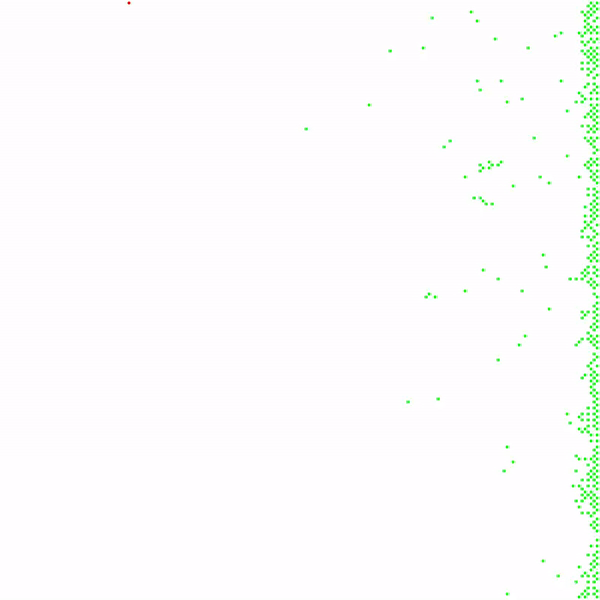
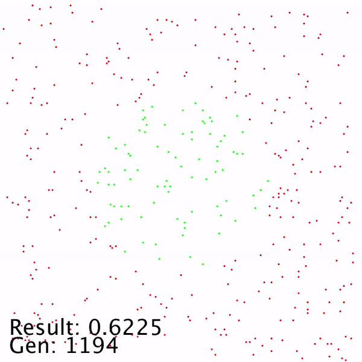
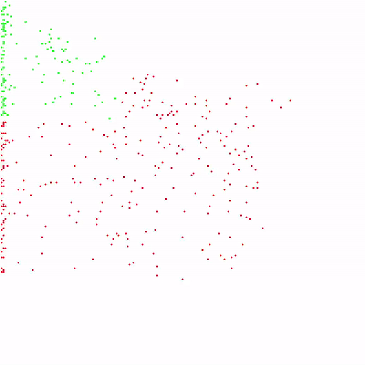

# My first Genetic Algorithm

## Introduction

I wanted to try making this simple genetic program after watching [this youtube video](https://www.youtube.com/watch?v=N3tRFayqVtk) from davidrandallmiller

This was made with Processing Java 

## How it works

The dots move around. They have position neurons for sensing their location and have an oscillator neuron for possible cyclic behaviour. They have move neurons for moving in the X and Y direction. Then there are a certain number of hidden neurons and genes (connections) that are used to make decisions and move the dots around. *Honestly, I'm not sure if gene is the right word to use, but typing "gene" is easier than typing "connection" so here we are*

By default, I set the number of genomes to 32 and hidden neurons to 16. *Now that I'm writing this, I feel like there should be less hidden neurons*

Every generation consists of a number of frames or steps. *I set it to 210 steps / generation*. In each generation, the dots have to make their way to a certain location before the end of the generation or else they can't make babies. *This can be modified in the naturalSelection() method of Body.pde.* At the end of each generation, a new population of dots is created (at random positions). Each new dot has inherits from a random survivor from the previous generation. Then there's a 1% chance that the dot will mutate. Mutating changes an old gene to a completely new gene. 

Then you wait a few hundred generations and pray the dots make it to the target. 

*\*Oh yeah the dots also collide unless you tell them not to\**

 

## Files

first_genetic.pde
- the main file
- handles the population, spawn position, and results
- draws all the dots

Body.pde
- the body of each dot
- handles the movement and conditions for death / survival

Brain.pde
- the brain of each dot
- sends input to neurons and outputs to the body
- processes the neural network
- handles mutations and inheriting from parents

Gene.pde
- consists of a sink node, source node, and weight
- is a directed weighted connection between two neurons
- connections will always be from 
  - input -> output
  - input -> hidden
  - lower hidden -> higher hidden (if there are multiple hidden neurons in brain)
  - hidden -> output

Neuron.pde
- a single neuron
- stores info about the type of neuron and a value for the output
- hidden and output neurons also output with an non-linear activation function (tanh)

Utils.pde
- has a sort method for sorting genes in the order of *input -> hidden0 -> hidden1 -> ... -> output*

 

## Video Snapshots

 

The dots survive by ending up on the right half of the screen. Collision is turned on.

 
 

The dots survive by being within a certain radius of the center of the screen. Collision is turned off.

 
 

The dots survive by going to either to top left corner of bottom right corner of the screen. Collision is turned off

 
 

## Results

Collision affects the results drastically as the dots can get stuck to each other.

When the dots form a pattern after a hundred generations or so, it's difficult for them to change their pattern. I think this could be due to a low mutation rate (I haven't checked yet) or the way dots inherit from their parents could be weird. 

The image below is what the neurons look like after training for several hundred generations (generated with Python, Matplotlib and NetworkX based on the save states of a generation)

## Todo (may or may not do them)
- [x] save and load the population
- [x] new sensor or output neurons
  - [x] random neuron
  - [ ] change posX and posY with distance to the 4 borders
  - [ ] detect nearby dots
- [ ] add fitness
- [ ] make GUI
- [x] visualize network
